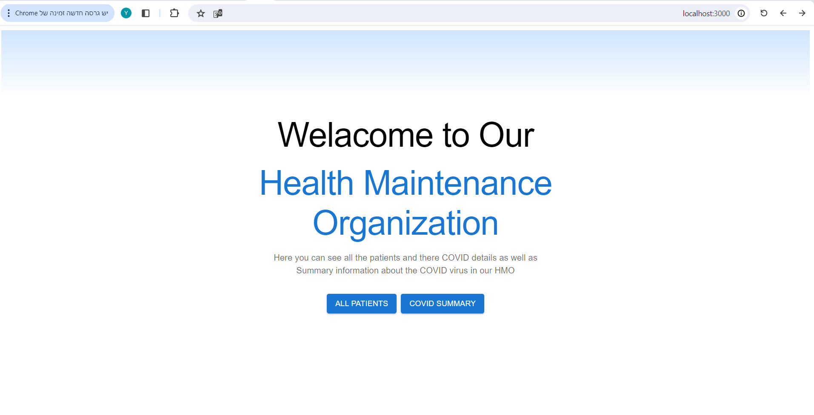
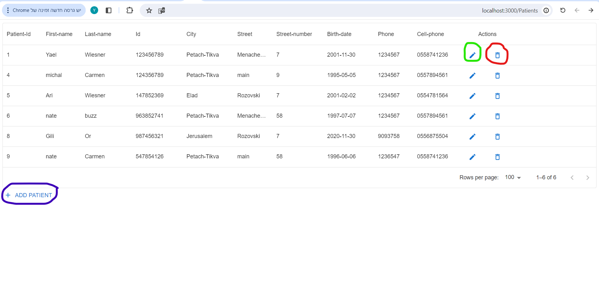
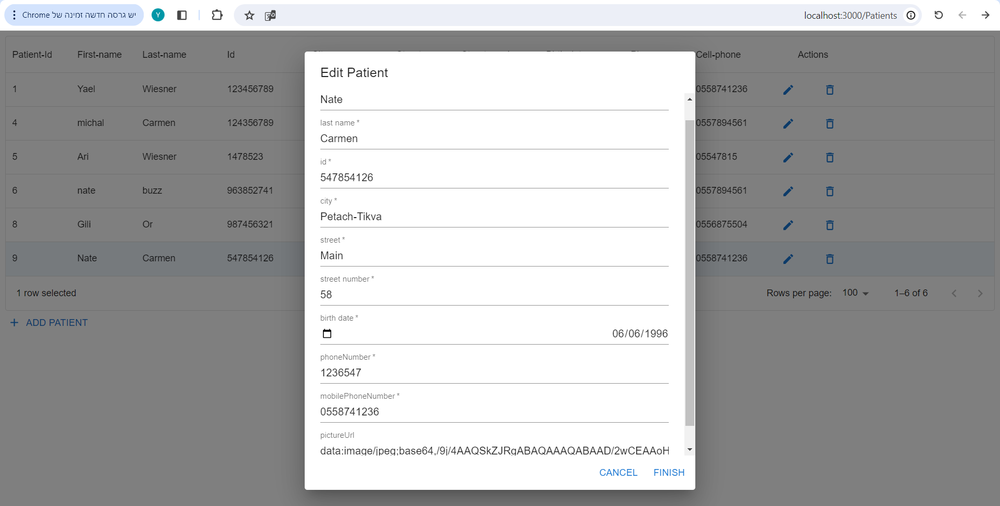
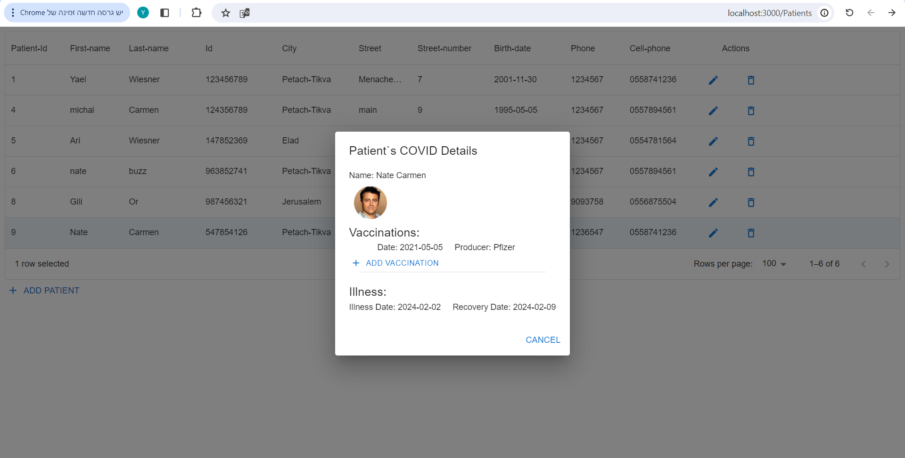
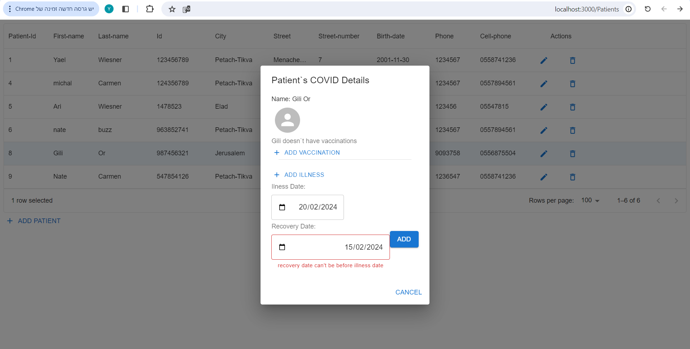
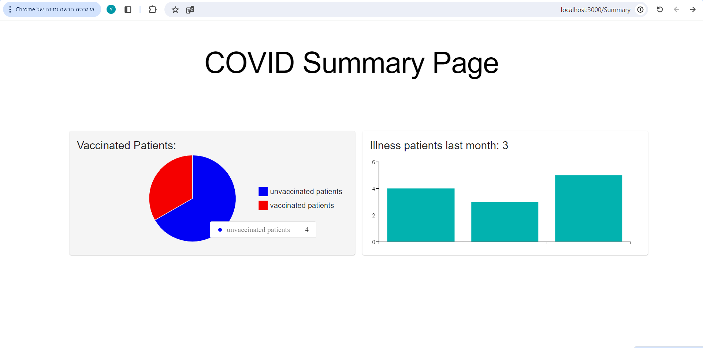

#Description:

  This is a full-stack web application built using Node.js, Express.js, Prisma, React, and TypeScript. It provides a seamless experience for users to interact with the backend services and frontend interface.

#Features:

  Backend:
  Built with Node.js and Express.js for handling server-side logic and API endpoints. Utilizes Prisma as an ORM for interacting with the PostgreSQL database.
  
  Frontend:
  Developed with React for building a dynamic and responsive user interface. Axios is used for making HTTP requests to the backend API.
  
  Database:
  PostgreSQL database is used to store and manage application data. pgAdmin is utilized as the database management tool.

#Installation:

  1.Node.js and npm:
  
    Make sure you have Node.js installed. You can download and install it from Node.js website.
    npm (Node Package Manager) comes bundled with Node.js installation. Ensure npm is properly installed by running npm -v in your terminal.
  
  2.Clone the repository: git clone https://github.com/YaelMetz1/Hadasim4.git
  
  3.Install dependencies:
  
    Navigate to the backend directory: $cd server
    and then run the command: $npm install
    
    Navigate to the frontend directory: $cd client 
    and then run the command: $npm install
  
  4.Database setup:
  
    Make sure you have PostgreSQL installed and running. Set up your database connection details in the backend's .env file.
  
  5.Start the backend server:
  
    Navigate to the server directory: $cd server
    and then run the command: $npx ts-node src/index.ts
  
  6.Start the frontend development server:
  
    Open new terminal.
    Navigate to the frontend directory: $cd client
    and then run the command: $npm start
  
  7.Accessing the application:
  
    Once both the backend server and frontend development server are running, 
    you can access the application by visiting http://localhost:3000 in your web browser. 

#Explanation of how to use the site:

  In "Home Page", for watching all the patients, press on "ALL PATIENTS" button:

    

      To add, delete and edit patient click on the buttons marked respectively:
    

      After clicking on edit button you can change his details(as well as the patient`s profile photo):
      

      To see patient`s details  and for editing his COVID details, click on his row:
       

      Pay attention to insert validate data:
      

  To see COVID summary details, press on "COVID SUMMARY" button in "Home Page":
      

